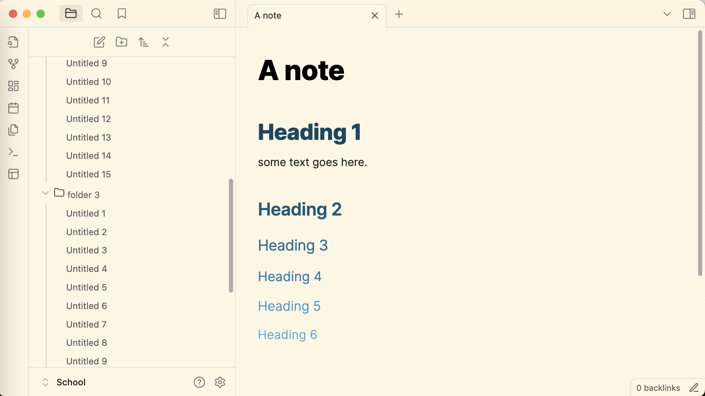

# Abate

---

> Abate
Custom light and dark theme for Obsidian. Lightens and softens tone for a paper-like read.

Colors of this theme is inspired by [Everforest](https://github.com/sainnhe/everforest-vscode) as well as an [Everforest theme](https://github.com/0xGlitchbyte/obsidian_everforest) made for Obsidian by **@Glitchbyte**.

Features:
- Slick scrolling bar
- Light tone
- Dark tone
- Heading colored theme inspired by Word

That's all, I hope you enjoy using the theme!
