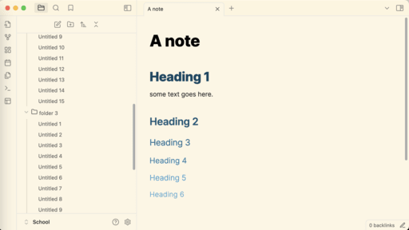

# Abate

---

> Abate
Custom light theme for Obsidian. Lightens tone for a paper-like read.

Colors of this theme is inspired by [Everforest](https://github.com/sainnhe/everforest-vscode) as well as an [Everforest theme](https://github.com/0xGlitchbyte/obsidian_everforest) made for Obsidian by **@Glitchbyte**.

That's all, I hope you enjoy using the theme!
